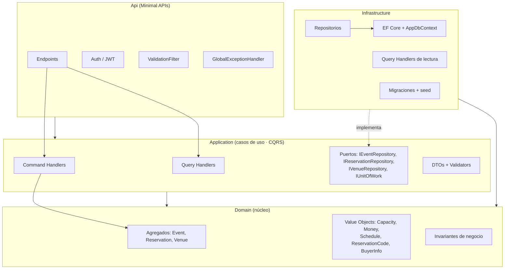
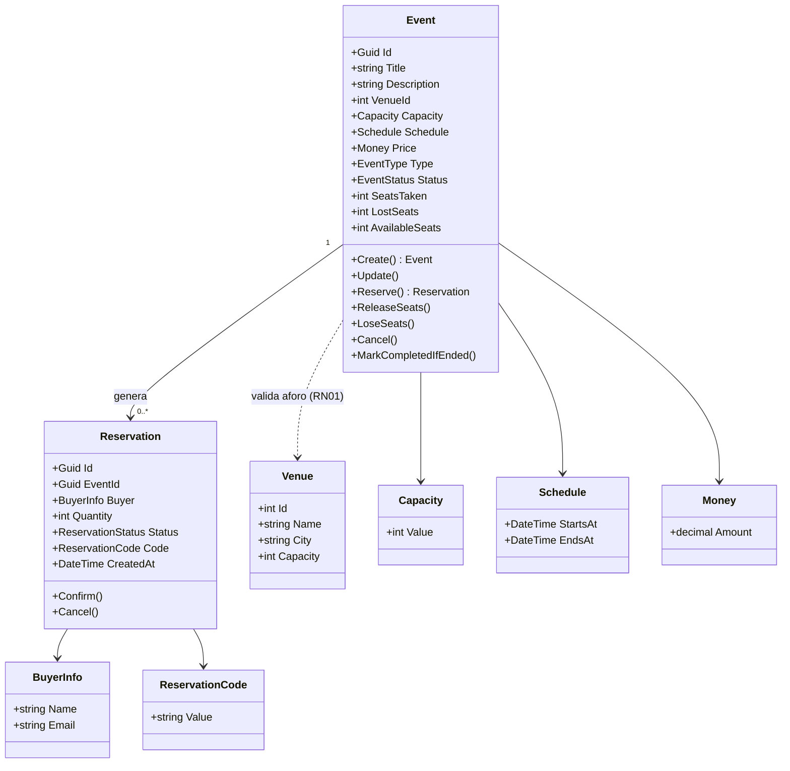
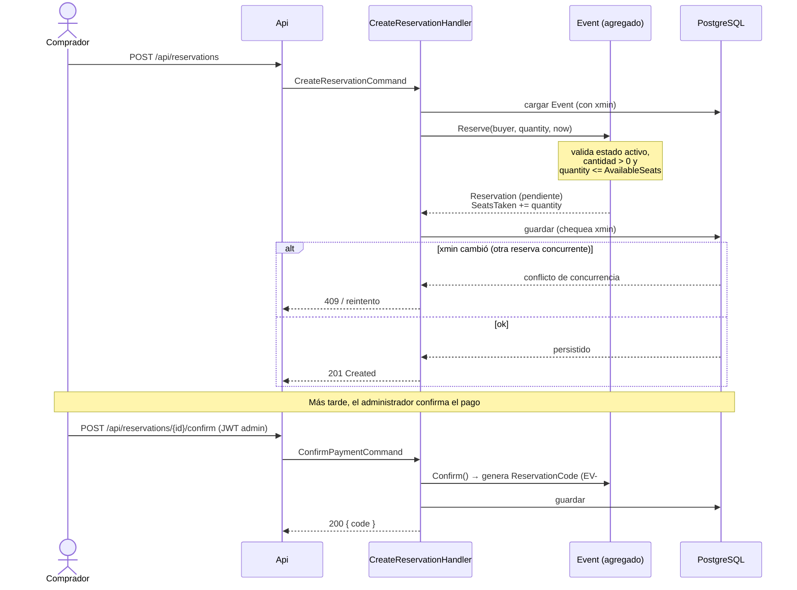
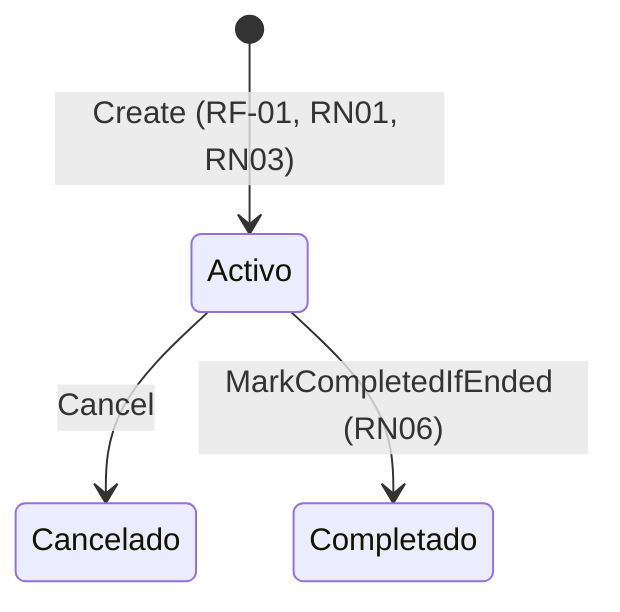
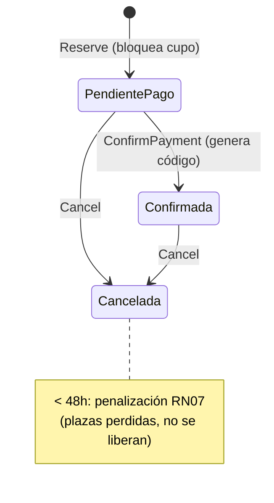

# Arquitectura · EventosVivos API

Este documento complementa los [ADRs](adr/) con diagramas. Todos están en Mermaid, que GitHub renderiza de forma nativa.

## 1. Capas (Clean Architecture)

Las dependencias apuntan hacia el dominio. Infrastructure implementa los puertos definidos en Application; Api es el detalle de entrega.

## 2. Modelo de dominio

## 3. Flujo anti-overbooking (crear y confirmar reserva)

El cupo se bloquea **al crear** la reserva (estado pendiente), no al confirmar. Así dos compradores no pueden llevarse las mismas últimas entradas. La concurrencia se protege con el token `xmin` de PostgreSQL.

## 4. Estados

### Evento

### Reserva

